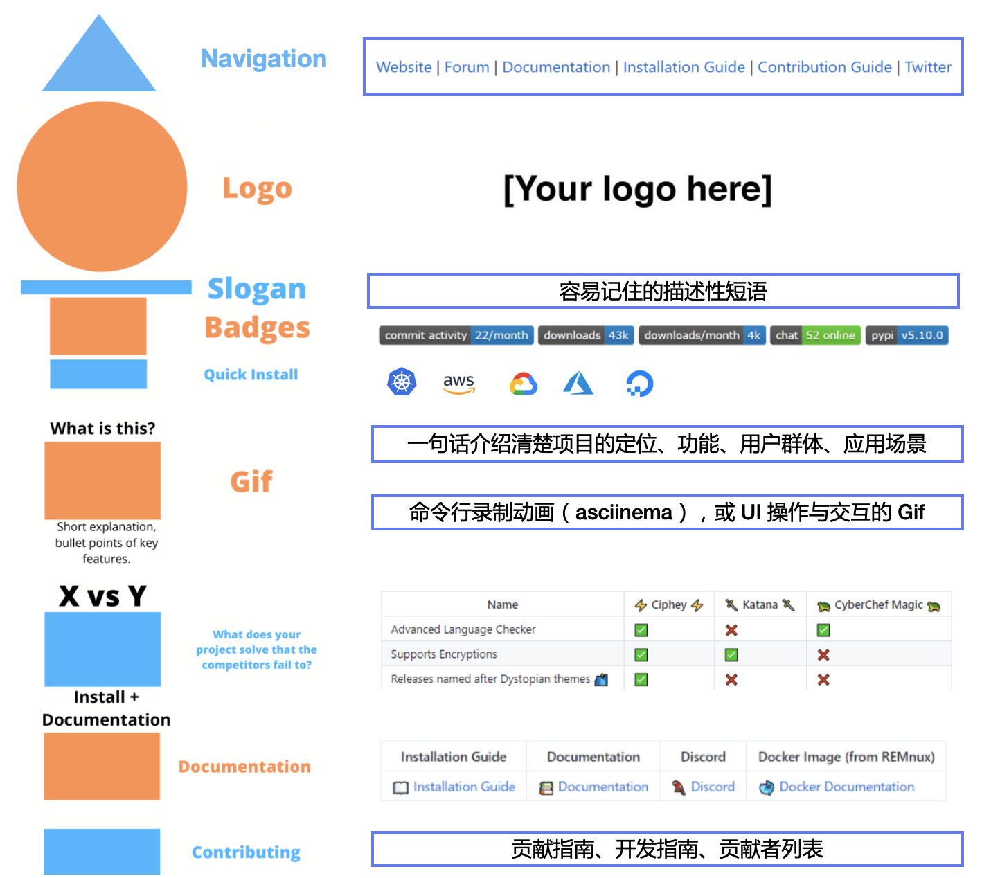

# README 规范与建议

开源项目的 README 是项目的第一张名片，对于开源项目的新手快速了解与使用我们的开源项目至关重要。我们可以通过图、文、Gif 动画等表现形式来丰富 README 的内容。

## 项目定义

在 README 顶部，为你的项目定义一个简明易懂的名字，以及设计一个醒目的 Logo。

## 项目介绍

为项目撰写一段言简意赅的介绍文案，让读者在 3 分钟内了解你的项目能做什么，应用于什么场景，能帮助用户解决什么问题。我们通常还可以添加一个功能列表，以及并添加一个链接到访问者可能不熟悉的参考资料。也可以在这里添加一个功能列表或一个背景小节。如果你的项目有替代方案，这也是列出区别因素的好地方。

## Badge 徽章（可选）

在一些开源项目的 README 中，你可能会在项目顶部看到的一些有意思的小图标，例如该项目是否通过了相关测试、镜像下载次数、Good First Issue 等，它可以非常有效地引导读者点击这些小图标去查看相关链接。我们可以用 [Shields](http://shields.io/) 这样的工具来给项目的 README 自动生成对应的徽章与连接。

## 视觉效果（可选）

如果是有用户 GUI 的开源项目，我们可以使用屏幕截图、视频或者是 GIF 动图的方式，像 [ttygif](https://github.com/icholy/ttygif) 或 [Asciinema](https://asciinema.org/) 可以给命令行提供 Gif 动图的录制。

## 安装说明

常见的软件安装方式例如 Yarn、NuGet 或 Homebrew 通常可以通过几条命令快速完成安装。然而，考虑到阅读 README 的人可能是个小白用户，希望得到更多的指导。列出具体步骤有助于消除歧义，可以帮助用户快速下载和安装我们的项目。如果它需要特定的环境下运行，如特定的编程语言版本或操作系统，以及在指定公有云或者基于 Kubernetes 安装，也需要提供超链接外链到相关安装文档。

我们通常可以使用折叠的方式来隐藏较为复杂的内容，用户可以选择性地展开查看更详细的内容。

## 文档或使用方法

如果可以的话，尽可能提供几个快速入门的使用示例，并展示预期输出。如果例子太长，无法合理地放在 README 中，则提供示例文档的链接或使用折叠展示的方式。

## 支持

清晰地告诉用户可以到哪里去寻求帮助，包括但不限于 GitHub issue、社群（如 Slack、Gitter）、电子邮件地址等方式。

## 路线图

如果我们社区对于项目未来的发布的想法，建议在 README 中直接列出项目的路线图以及 GitHub 或 Gitee 上对应的 Milestone。

## 参与贡献

说明我们的项目是否对贡献者开放，以及接受社区贡献的 Pull Request 要求是什么，例如是否需要签署 CLA，是否需要参考和遵循哪些代码与文档规范。

我们通常可以提供一些贡献则文档、开发指南、测试文档，清晰地说明参与我们开源项目的开发与测试流程是什么。这些步骤有助于确保贡献者提交的代码与文档质量，并在一些工作上达成共识。

## 鸣谢（可选）

最好能够在 README 中对所有为项目做出贡献的人表示感谢，这样不仅能够社区的多元性，还能吸引更多的贡献者参与。

## 许可证

对于开放源码项目，请说明开源项目开源。
